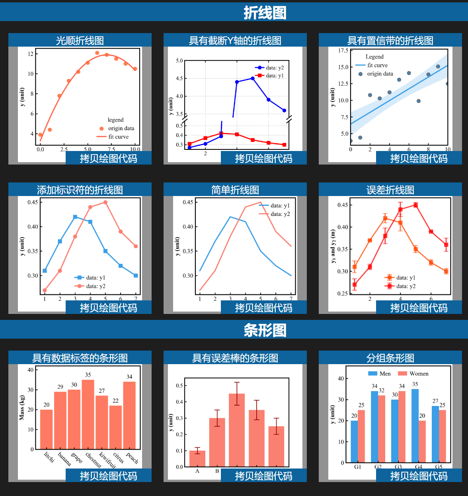

[English](README_en.md) | [中文](README.md)

# Matplotlib 模板控制台
---

<p align="center">
<a href="https://github.com/psf/black/blob/main/LICENSE"></a>
<a href="https://github.com/psf/black"></a>
</p>

这是一个用于管理 [Matplotlib](https://matplotlib.org) 模板的项目。

[Matplotlib](https://matplotlib.org)是一个非常受欢迎的 Python 绘图库，它提供了丰富的绘图功能，并且易于使用。使用模板可以快速地生成高质量的图表，并且可以轻松地进行定制。然而一直以来都缺乏一个方便的模板管理工具，因此本项目应运而生。

本项目可以将文件夹下的 notebook 脚本集成到一个html网页中，从而可以方便的查找和使用模板。
- 点击`Copy`按钮，将图片对应的绘制脚本复制到剪贴板
- 点击图片标题按钮，可以使用下载方式保存绘图代码到`notebook`文件中



## 如何添加模板

- 下载代码后按照下面的构建方法尝试构建，只需要将自己的模板文件（`.ipynb`后缀）添加到`notebook`文件夹下即可
- 如果想要分享绘图模板，欢迎提交PR

## 构建方法

依次执行以下脚本，构建文件均在build目录下：
- `ipynb2py.py`: 提取ipynb文件中的代码到py文件
- `py2image.py`: 使用py文件生成图片，png格式
- `dir2html.py`: 根据目录结构生成html文件
- `resource_embedding.py`: 将代码和图片嵌入到html文件中
- `clean_notebook_output.py`: 清理ipynb文件的输出，只保留代码，避免提交不必要的信息到仓库

### 构建依赖

> 也可以屏蔽部分案例，减少依赖

- matplotlib: 推荐 3.9.4 版本
- numpy: 许多notebook中都使用了numpy的函数
- scipy: 个别notebook中使用了scipy的函数
- meshio: 个别notebook中使用了meshio的函数
- bs4: 用于解析html文件

如果你想要自己构建，可以使用以下命令安装依赖：
```bash
pip install -r requirements.txt
```

## 关于我们

<a href="https://space.bilibili.com/3546387249629871" target="_blank"></a> [matplotlib制图师](https://space.bilibili.com/3546387249629871)

<a href="https://marketplace.visualstudio.com/items?itemName=litchi.plt-snippet" target="_blank"></a> 开发的 VS Code 插件 [Matplotlib Pilot (Chinese)](https://marketplace.visualstudio.com/items?itemName=litchi.plt-snippet)

学习笔记 [matplotlib 在线手册](https://www.wolai.com/matplotlib/uecbhR3MHhaZkK55za779h) 
